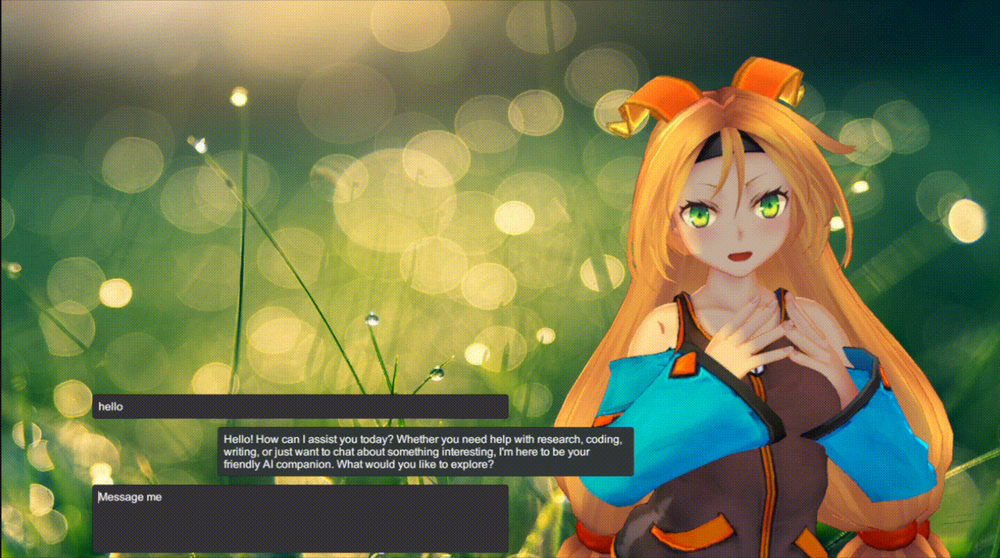
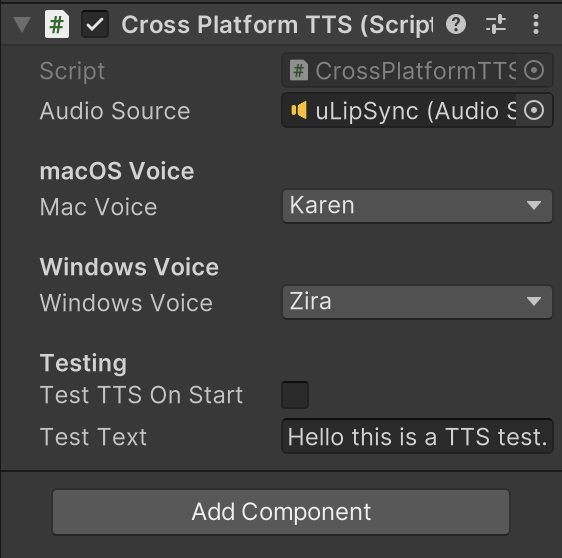

# 3d-avatar-lip-sync-tts-llm-unity
Real-time 3D avatar system in Unity with lip sync, text-to-speech, and LLM-powered dialogue.

This is a proof-of-concept project to showcase the interaction with an AI avatar.
Feel free to use this repo as a start to your unity 3d avatar project, it serves as a demo for how the various plugins made available by other devs can integrated to achieve this result.

LLMUnity provides the llm plugin that allows us to use the downloaded llm as the chatbot base.
The cross-platform TTS script allows the selection of native voice generation using the native OS text-to-speech capabilities.
uLipSync allows us to feed the audio generated from the TTS voice to play the animation on the 3d model using blendshapes.
Unity-Chan! is used as the model and was set up as detailed in uLipSync's github readme.

You may select your choice of voice for each platform. Test audio will be played at the start of the play mode.

Note:
* You will need to initialise LLMUnity on your first run. Refer to the official github for LLMUnity for instructions on how to set up. Open the scene, then select the LLM game object, download the libraries and also the LLM model of your choice.

* MacOS and Windows platforms are supported but it is only tested on MacOS.

* Unity version used : 2022.3.62f2

This repository’s original code is MIT-licensed; third-party assets and dependencies remain under their own licences.
Credits are fully attributed to the following projects:

1. LLMUnity
https://github.com/undreamai/LLMUnity
license: Apache-2.0 license

2. uLipSync
https://github.com/hecomi/uLipSync
license: MIT license

4. Unity-Chan!
https://unity-chan.com
license: Unity-chan License Terms Version 3.0
Unity Technologies Japan/UCL

All license files are included within the distributed versions in this project.
